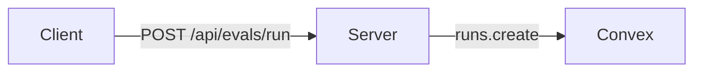

## User story

<!-- Who this is for and what they can do after it merges. Name a specific persona: "hosted evals user", "self-hosted admin", "on-call engineer", not "the user". -->

**As a** ...,
**I want** ...,
**so that** ...

### Acceptance criteria

<!-- 3 to 7 conditions a reviewer can check without asking you. Pattern: [thing] [does / shows / prevents] [behavior] [under condition]. Include the error state, not only the happy path. Tick each one you verified. -->

- [ ] ...
- [ ] ...
- [ ] ...

## What this does

<!-- One paragraph on why the code is this way now. Leave the narration of the diff to the diff. -->

## Architecture

<!-- Required when the PR adds a component, moves a boundary, or changes how data or requests flow. A Mermaid block renders on GitHub. Draw only the parts this PR touches and label each arrow with what crosses it. Otherwise write "None: no new component or flow".

-->

## Screenshots and recordings

<!-- Required for any visible change. Use before and after for a static change and a short recording (under 60 s) for an interaction, loading state or error path. Otherwise write "None: no UI change". -->

| Before | After |
| --- | --- |
|  |  |

## Deleted

<!-- Files, functions or paths this removes, or "Nothing". If a v2 lands here, name the v1 and when it goes. -->

## Reused

<!-- Existing helpers, components or modules this builds on instead of writing new ones, or "Nothing applicable". -->

## Production signal

<!-- The event, metric, log or alert that shows this works after deploy, or "None: not user-facing". -->

## Checklist

- [ ] I can explain every line of this diff without the agent that wrote it.
- [ ] Under 400 hand-written changed lines, or labelled `large-pr` / `mechanical`.
- [ ] No new `as any`, empty `catch`, `.catch(() => {})` or raw `console` on the server.
- [ ] Comments say why the code is this way, not how it got here.
