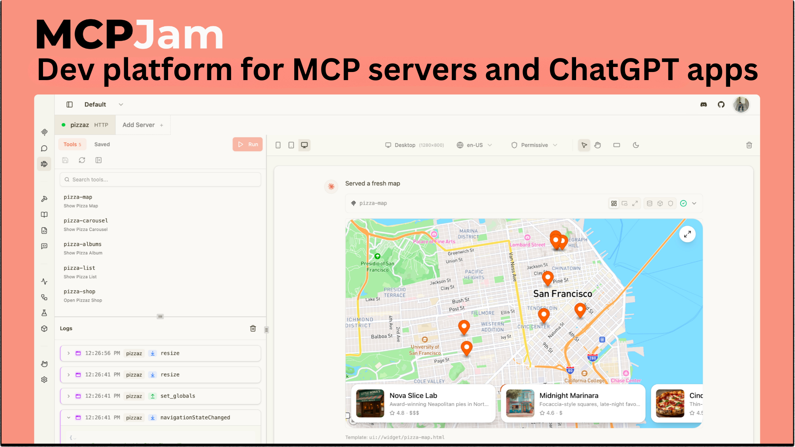
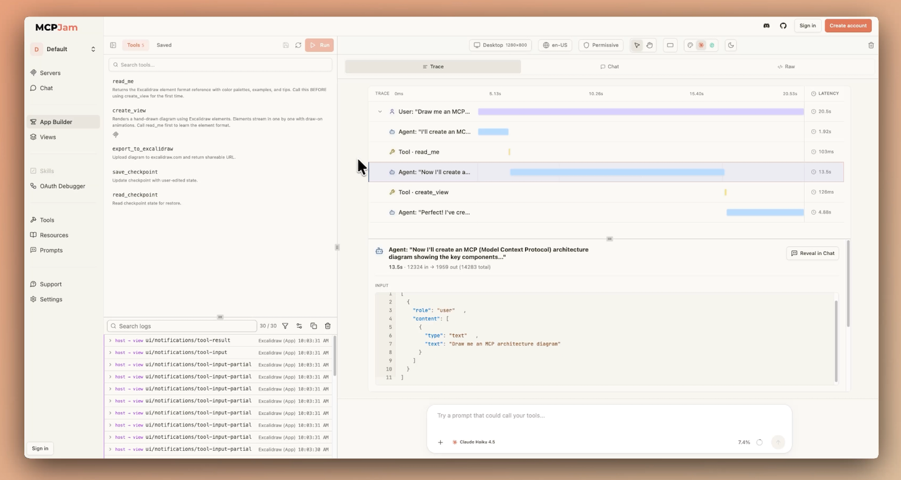
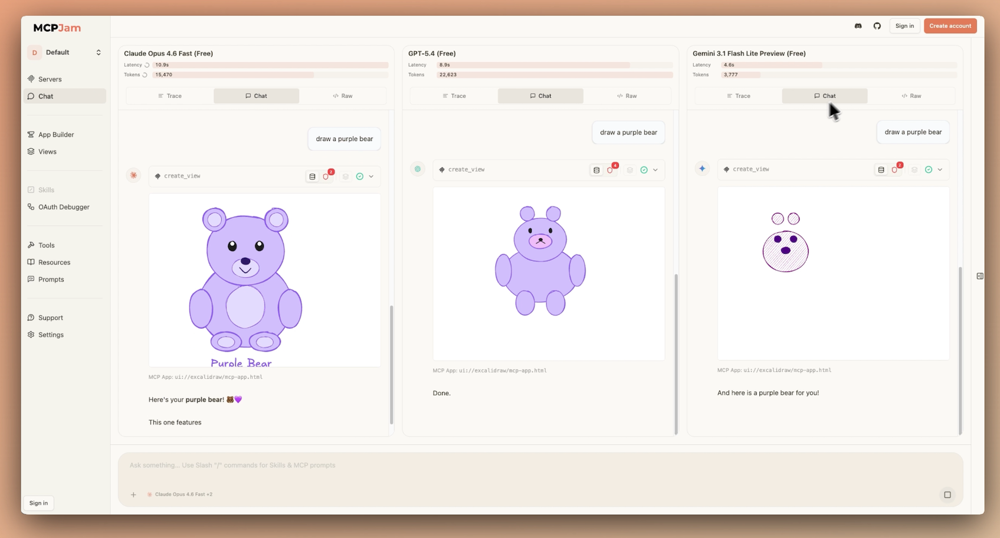
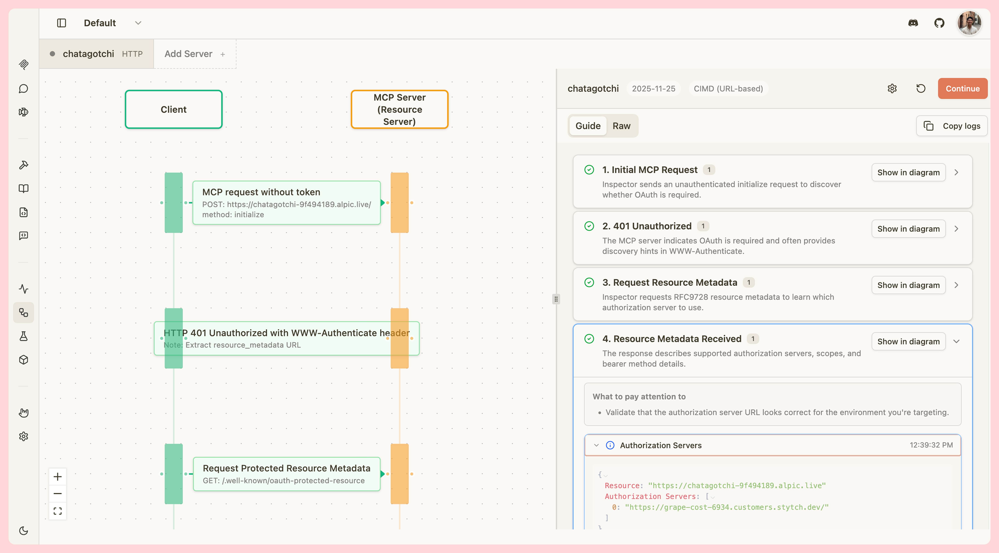
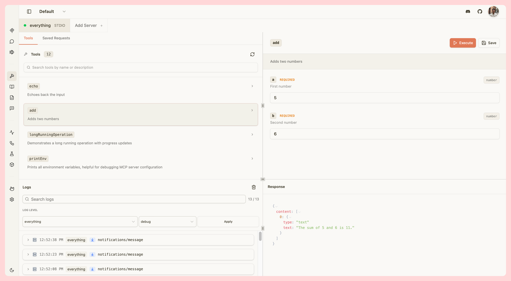

<div align="center">

<picture>
  <source media="(prefers-color-scheme: dark)" srcset="./mcpjam-inspector/client/public/mcp_jam_dark.png">
  <source media="(prefers-color-scheme: light)" srcset="./mcpjam-inspector/client/public/mcp_jam_light.png">
  
</picture>

<br/>

www.mcpjam.com

[](https://www.npmjs.com/package/@mcpjam/inspector)
[](https://opensource.org/licenses/Apache-2.0)
[](https://discord.gg/JEnDtz8X6z)
[](https://safeskill.dev/scan/mcpjam-inspector)

</div>

MCPJam is the development platform for MCP servers, MCP apps, and ChatGPT apps.

- **Debug**: Inspect every JSON-RPC message and OAuth exchange across host configurations with full traces.
- **Chat**: Talk to any LLM against your server with full trace visibility into tool calls and context across agent, host app, your server.
- **Inspect**: Explore your server’s tools, resources, and prompts in one place.
- **Evaluate**: Run evals across multiple LLMs and track accuracy over time so you catch regressions early.
- **CLI**: Probe servers, run doctor checks, exercise OAuth flows, and list tools/resources/prompts straight from your terminal.
- **SDK**: Programmatically drive inspections, snapshot server capabilities, and assert on tool/resource shapes from your own tests.
- **CI/CD**: Wire the CLI and SDK into GitHub Actions (or any pipeline) to run e2e tests, evals, OAuth checks, and spec conformance on every PR.

No more ngrok or ChatGPT/Claude subscription needed. MCPJam is the fastest way to iterate on any MCP project.

### 🚀 Quick Start

Open the hosted web app. No install needed.

👉 [app.mcpjam.com](https://app.mcpjam.com)

Or run MCPJam locally for HTTP/S and local STDIO servers:

```bash
npx @mcpjam/inspector@latest
```



# Table of contents

- [Installation Guides](#installation-guides)
- [Key Features](#key-features)
  - [App Builder](#app-builder)
  - [Chat](#chat)
  - [OAuth Debugger](#oauth-debugger)
  - [MCP Server Debugging](#mcp-server-debugging)
  - [Skills](#skills)
  - [Workspaces](#workspaces)
  - [Evals](#evals)
  - [CLI](#cli)
  - [SDK](#sdk)
  - [CI/CD](#cicd)
- [Contributing](#contributing-)
- [Links](#links-)
- [Community](#community-)
- [Shoutouts](#shoutouts-)
- [License](#-license)

# Installation Guides

MCPJam Inspector runs three ways: a hosted web app, a desktop app for Mac and Windows, or via your terminal. The web app is HTTPS-only and has no install. Terminal and Desktop support HTTP/S and local STDIO servers.

### Requirements

[](https://nodejs.org/)
[](https://www.typescriptlang.org/)

Node.js 20+ is only required for the terminal install (`npx`). The hosted web app and desktop apps have no local runtime requirements.

## Hosted Web App

Open [app.mcpjam.com](https://app.mcpjam.com) in your browser. No install required. Always on the latest version, and you can share MCP server links with teammates the same way you'd share a Google Doc.

- HTTPS MCP server URLs only (for HTTP or local STDIO servers, use Desktop or Terminal).
- No STDIO, tunneling, skills, or tasks. Those require the local inspector.

See [Hosted App docs](https://docs.mcpjam.com/hosted/overview) for details.

## Desktop App

Download the installer for your OS. Supports HTTP/S and local STDIO servers. No Node.js required.

- [Install Mac](https://github.com/MCPJam/inspector/releases/latest/download/MCPJam.Inspector.dmg)
- [Install Windows](https://github.com/MCPJam/inspector/releases/latest/download/MCPJam-Inspector-Setup.exe)

## Terminal

Run the inspector via `npx` (supports HTTP/S and local STDIO):

```bash
npx @mcpjam/inspector@latest
```

After it starts, open the printed `localhost` URL in your browser.

## Docker

Run MCPJam Inspector using Docker, bound to localhost for security:

```bash
docker run -p 127.0.0.1:6274:6274 mcpjam/mcp-inspector
```

The app is available at `http://127.0.0.1:6274`. Always use `-p 127.0.0.1:6274:6274` (not `-p 6274:6274`) to keep the inspector local-only. On macOS/Windows, connect to host MCP servers via `http://host.docker.internal:PORT` instead of `127.0.0.1`.

# Key features

| Capability           | Description                                                                                                                                                                                                        |
| -------------------- | ------------------------------------------------------------------------------------------------------------------------------------------------------------------------------------------------------------------ |
| App Builder          | Debug your server against a model: tool calls or in-panel chat, with Chat, Trace, and Raw. OpenAI Apps SDK and MCP app UIs, text tools, Chrome DevTools-style widget emulator. [Read more](https://docs.mcpjam.com/inspector/app-builder) |
| Chat                 | Multi-server chat on frontier models (free). Chat, Trace, Raw; compare up to 3 models. [Read more](https://docs.mcpjam.com/inspector/chat)                                                                         |
| OAuth Debugger       | Guided MCP OAuth conformance checks: protocol versions 03-26, 06-18, 11-25; DCR, client pre-registration, CIMD. [Read more](https://docs.mcpjam.com/inspector/guided-oauth)                                        |
| MCP Server Debugging | Manually run tools, resources, templates, and elicitation; full JSON-RPC logs.                                                                                                                                     |
| Skills               | Skills in Chat and App Builder; local filesystem only. [Read more](https://docs.mcpjam.com/inspector/skills)                                                                                                       |
| Workspaces           | Shared server groups with real-time team sync. [Read more](https://docs.mcpjam.com/inspector/workspaces)                                                                                                           |
| Evals                | Test cases with expected tool calls, run across LLMs, metrics. [Read more](https://docs.mcpjam.com/inspector/test-cases)                                                                                           |
| CLI                  | Run MCPJam checks, probes, and evals from the terminal. Perfect for local dev loops and CI. [Read more](https://docs.mcpjam.com/cli/overview)                                                                      |
| SDK                  | Programmatic access to MCPJam for custom tooling, scripting, and integrations. [Read more](https://docs.mcpjam.com/sdk)                                                                                            |
| CI/CD                | Run MCPJam checks and evals in GitHub Actions and other CI systems to gate PRs on regressions. [Read more](https://docs.mcpjam.com/cli/ci)                                                                         |

## App Builder

Debug your server against a model using tool calls or in-panel chat, with Chat, Trace, and Raw views. Supports OpenAI Apps SDK and MCP app UIs, text tools, and a Chrome DevTools-style widget emulator to iterate on widgets locally.

- Manually invoke a tool to instantly view the widget, or chat with your server using an LLM.
- View all JSON-RPC messages and `window.openai` messages in the logs.
- Change emulator device to Desktop, Tablet, or Mobile views.
- Test your app's locale change, CSP permissions, light / dark mode, hover & touch, and safe area insets.




_Trace view: every tool call, agent step, and JSON-RPC message._

## Chat

Multi-server chat on frontier models for free, or bring your own API key. Chat, Trace, and Raw views; compare up to 3 models side-by-side. View your server's token usage.



## OAuth Debugger

Guided MCP OAuth conformance checks with step-by-step explanations. Test against every version of the OAuth spec (03-26, 06-18, and 11-25). Support for client pre-registration, Dynamic Client Registration (DCR), and Client ID Metadata Documents (CIMD).



## MCP Server Debugging

MCPJam contains all of the tooling to test your MCP server. Manually run tools, resources, resource templates, prompts, and elicitation flows, with full JSON-RPC observability. MCPJam has all features from the original inspector and more.



## Skills

Use Skills in Chat and App Builder to extend models with local, reusable behaviors. Local filesystem only. Your data never leaves your machine. [Read more](https://docs.mcpjam.com/inspector/skills)

## Workspaces

Group your servers into shared workspaces with real-time team sync, so everyone on your team is testing against the same configuration. [Read more](https://docs.mcpjam.com/inspector/workspaces)

## Evals

Define test cases with expected tool calls and run them across multiple LLMs. Track accuracy metrics over time to catch regressions early and improve your server with every iteration. [Read more](https://docs.mcpjam.com/inspector/test-cases)

## CLI

Run MCPJam from the terminal for fast local dev loops and CI integration. Probe servers, run OAuth checks, inspect tools and resources, and execute evals without leaving your shell. [Read more](https://docs.mcpjam.com/cli/overview)

## SDK

Programmatic access to MCPJam for custom tooling, scripting, and integrations. Build your own workflows on top of MCPJam's inspection and evaluation primitives. [Read more](https://docs.mcpjam.com/sdk)

## CI/CD

Wire MCPJam into GitHub Actions, GitLab CI, or your CI system of choice to run conformance, E2E tests, and evals on every PR. Catch MCP server regressions before they ship. [Read more](https://docs.mcpjam.com/cli/ci)

# Contributing 👨‍💻

We're grateful for you considering contributing to MCPJam. Please read our [contributing guide](CONTRIBUTING.md).

Join our [Discord community](https://discord.gg/JEnDtz8X6z) where the contributors hang out at.

# Links 🔗

- [Website](https://www.mcpjam.com/)
- [Blog](https://www.mcpjam.com/blog)
- [Pricing](https://www.mcpjam.com/pricing)
- [Docs](https://docs.mcpjam.com/)

# Community 🌍

- [Discord](https://discord.gg/JEnDtz8X6z)
- [𝕏 (Twitter)](https://x.com/mcpjams)
- [LinkedIn](https://www.linkedin.com/company/mcpjam)

# Shoutouts 📣

Some of our partners and favorite frameworks:

- [Stytch](https://stytch.com). Our favorite MCP OAuth provider.
- [xMCP](https://xmcp.dev/). The Typescript MCP framework. Ship on Vercel instantly.
- [Alpic](https://alpic.ai/). Host MCP servers. Try their new [Skybridge framework](https://github.com/alpic-ai/skybridge) for ChatGPT apps!

---

# License 📄

This project is licensed under the **Apache License 2.0**. See the [LICENSE](LICENSE).
