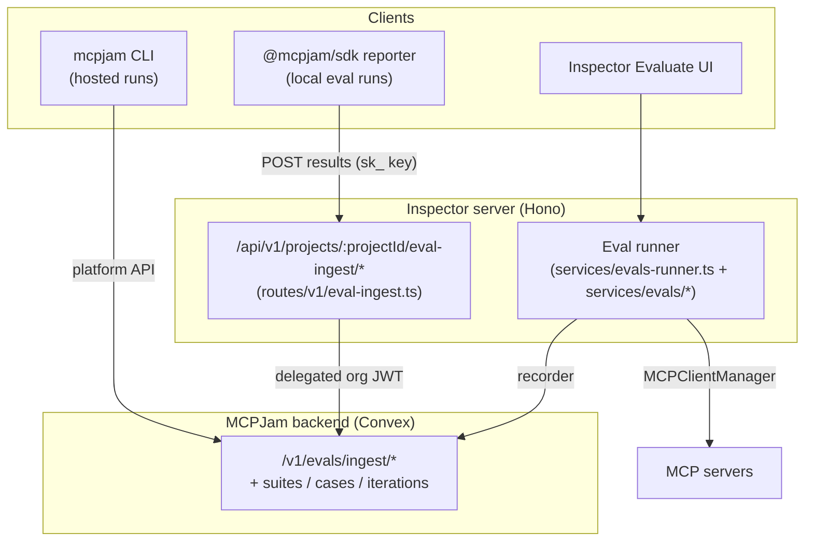

The evals system spans three surfaces that share one backend:

- **Inspector Evaluate UI** — author suites and cases, run them hosted, inspect traces. See [Evaluate](/inspector/evals) for the product view.
- **`@mcpjam/sdk`** — run evals in your own process (`EvalTest` / `EvalSuite`) and upload results. See [Running Evals](/sdk/concepts/running-evals).
- **`mcpjam` CLI** — author, start, and inspect hosted runs from a terminal (`mcpjam eval …`). See the [command reference](/cli/reference#eval-commands).

This page covers the wiring underneath: where results enter the system, how host configuration stays consistent across surfaces, and where the code lives.

## The big picture


```mermaid
graph TB
    subgraph Clients
        SDK["@mcpjam/sdk reporter<br/>(local eval runs)"]
        CLI["mcpjam CLI<br/>(hosted runs)"]
        UI[Inspector Evaluate UI]
    end

    subgraph Gateway["Inspector server (Hono)"]
        INGEST["/api/v1/projects/:projectId/eval-ingest/*<br/>(routes/v1/eval-ingest.ts)"]
        RUNNER["Eval runner<br/>(services/evals-runner.ts + services/evals/*)"]
    end

    subgraph Backend["MCPJam backend (Convex)"]
        CONVEX["/v1/evals/ingest/*<br/>+ suites / cases / iterations"]
    end

    SDK -->|"POST results (sk_ key)"| INGEST
    CLI -->|"platform API"| CONVEX
    UI --> RUNNER
    INGEST -->|"delegated org JWT"| CONVEX
    RUNNER -->|recorder| CONVEX
    RUNNER -->|MCPClientManager| MCP[MCP servers]
```

Two distinct write paths matter:

1. **Ingestion** — externally produced results (SDK auto-save, manual reporting APIs, artifact uploads) enter through the `eval-ingest` HTTP surface.
2. **Hosted runs** — the Inspector's own runner executes iterations server-side and persists through its recorder; the CLI's `eval run` starts these hosted runs via the platform API.

## HostConfig consolidation

The Playground (live chat) and Evals share a single, portable `hostConfig` core that lives in `@mcpjam/sdk/host-config/`. Everything that drives an LLM-plus-MCP loop — host style, model, sandbox/permission policy, OpenAI-Apps compat, tool-visibility, MCP server selection — flows through one canonical shape and one hash.

```
@mcpjam/sdk/host-config/
  types.ts          # HostConfigInputV2, HostJson, CspDomainSet, …
  canonicalize.ts   # canonicalizeHostConfigV2 — byte-stable JSON
  hash.ts           # computeHostConfigHashV2 — sha256(canonical)
  defaults.ts       # emptyHostConfigInputV2, resolveEffectiveMcpProtocolVersion, …
  host-policy.ts    # extractHostExecutionPolicy, buildHostIterationMetadata
  compat-runtime.ts # resolveOpenAiCompatForHostConfig
  tool-visibility.ts# filterAppOnlyTools, applyVisibilityPolicyAndCountSignals
  sdk-evals-normalizer.ts # normalizeSdkEvalHostConfigForWire (Stage 5)
```

This module is the **one source of truth**. The MCPJam backend imports the canonicalizer + hasher directly from `@mcpjam/sdk/host-config/internal`; see `mcpjam-backend/convex/lib/hostConfigV2.ts` — the file is a thin Convex-bound wrapper (server-scope validation, `Id<'servers'>` boundary cast) over the SDK functions, not a parallel implementation.

**Two boundaries inside the inspector consume this module:**

- **Outbound (backend → target MCP server).** The eval runner builds an `MCPClientManager`, connects to the suite's servers, and drives an `HostRunner` over the resolved host. Imports:
  - `extractHostExecutionPolicy` / `buildHostIterationMetadata` from `@mcpjam/sdk/host-config/internal` (Stage 3) — was previously `server/services/evals/host-execution-policy.ts`; the local file is now deleted.
  - `resolveOpenAiCompatForHostConfig` from `@mcpjam/sdk/host-config/internal` (Stage 3) — was previously the local `compat-runtime.ts`; only the Convex-bound `loadSuiteHostConfig` remains in the inspector.
  - `filterAppOnlyTools` from `@mcpjam/sdk/host-config/internal` (Stage 3) — same predicate the chat-v2 path uses, no fork.
- **Inbound (frontend → backend).** The eval results API persists per-iteration `hostConfigId` rows that reference the same `hostConfigs` table the chatbox/playground writes.

The Playground's chat-v2 path consumes the same module — playground and evals are two surfaces over the same configuration vocabulary; see [playground-architecture.mdx](./playground-architecture#hostconfig-consolidation) for the live-path side of the same picture.

### `HostRunner`, `HostRuntime`, `HostExecutor` (Stage 4 rename)

Inside `@mcpjam/sdk`, the executor surface was renamed in 1.11 to align with MCP spec vocabulary:

- `TestAgent` → `HostRunner` — synchronous executor over a host snapshot with tools pre-resolved.
- `EvalAgent` → `HostExecutor` — interface implemented by both `HostRunner` and `HostRuntime`.
- `.prompt()` → `.run()` on the interface and both impls.
- `Host.addServer()` → `Host.requireServer()`.
- `HostRuntime` (new) — live binding of a `Host` to an `MCPClientManager` (`host.withManager(manager, { apiKey })`). Snapshots the live host on every `.run()`; stateless across turns.
- `EvalTest.run` / `EvalSuite.run` parameter renamed `agent` → `executor`.

`EvalTest` and `EvalSuite` accept any `HostExecutor`, so an external user can run the same eval against their own runtime as long as it implements `getHostSnapshot?.()`.

### Per-iteration host metadata + Stage 5 wire-send

`HostRunner` snapshots the host once at construction; `HostRuntime` re-snapshots on every `.run()`, so mid-eval mutation to the bound `Host` is captured per-iteration. Each `IterationResult` carries `hostSnapshot?: HostJson` and a derived metadata stamp (`buildHostSnapshotMetadata`) that is additively merged into `EvalResultInput.metadata` (existing keys are never overwritten — conflicting host keys are namespaced under `host.<key>`).

The SDK eval reporter additionally sends `{ hostConfig, hostConfigHash }` at the run boundary. The v1 ingest surface always accepts the pair — the old per-`baseUrl` capability probe is gone:

- `POST /api/v1/projects/:projectId/eval-ingest/runs/start` (chunked path) — body includes the pair when iteration snapshots are homogeneous.
- `POST /api/v1/projects/:projectId/eval-ingest/report` (one-shot path) — same.
- `POST /api/v1/projects/:projectId/eval-ingest/runs/iterations` and `…/runs/finalize` — **never** carry the pair (per-run, not per-batch).

Source order, run-level only: `iteration.hostSnapshot` → `executor.getHostSnapshot?.()` → `MCPJamReportingConfig.host`. Today `EvalResultInput` carries no `hostSnapshot` field, so the shipped reporter effectively resolves executor → explicit host; the iteration slot and its homogeneity gate (send only when all snapshots canonicalize to the same hash) are forward-compatible for when per-iteration capture is wired through the wire shape (see the comment in `resolveWireHostConfigForRun`, `sdk/src/report-eval-results.ts`). Any error while resolving or canonicalizing the snapshot logs a warning and omits the pair rather than failing the upload.

`hostConfigHash` is a transport-integrity check — the backend re-runs `normalizeSdkEvalHostConfigForWire → canonicalizeHostConfigV2 → computeHostConfigHashV2` and rejects on mismatch. It is **not** the persisted storage id; suite-resolved Convex `Id<'servers'>` are layered on top at storage time, so the persisted `hostConfigsV2` row's hash differs from the wire hash by design.

### Two distinct sandbox layers

- The persisted host-config sandbox shape (`mcpProfile.apps.sandbox.csp` + `.permissions`) is **allowlist-only** — there is no `deny` field. This is the shape the backend stores and the canonicalizer hashes.
- The SDK runtime CSP **resolver** (`sandbox-policy.ts`) carries `deny` plus a hosted clamp for render-time enforcement. It is NOT the same type; the two share only leaf subtypes (`SandboxCspMode`, `SandboxPermissionsMode`, four-directive domain-set).

A canonicalize-time guard in the SDK rejects sandbox shapes that leak a `deny` key. Don't reuse `SandboxCspPolicy` / `SandboxPermissionsPolicy` for persisted host configs.

## Result ingestion API (`eval-ingest`)

External results enter through five `POST` endpoints, implemented as a thin proxy in `mcpjam-inspector/server/routes/v1/eval-ingest.ts` over the Convex `/v1/evals/ingest/*` surface:

| Endpoint | Purpose |
|----------|---------|
| `POST /api/v1/projects/:projectId/eval-ingest/report` | One-shot upload of a complete run |
| `POST /api/v1/projects/:projectId/eval-ingest/runs/start` | Open a run for chunked upload |
| `POST /api/v1/projects/:projectId/eval-ingest/runs/iterations` | Append a batch of iterations |
| `POST /api/v1/projects/:projectId/eval-ingest/runs/finalize` | Close the run and compute the verdict |
| `POST /api/v1/projects/:projectId/eval-ingest/artifacts/upload-url` | Mint an upload URL for large blobs (widget HTML snapshots) |

Proxy behavior worth knowing when debugging:

- The caller authenticates like any `/api/v1` route (typically an `sk_` API key); the proxy forwards to Convex with a **delegated org-scoped JWT**, not the caller's credential.
- A literal `default` in the `:projectId` segment is stripped from the payload so the backend resolves the org's Default project; any other value overwrites `payload.projectId`.
- The proxy caps request bodies at 6 MiB (the backend enforces its own 5 MiB limit) and times out after 60 s; status and body pass through verbatim.

<Warning>
The legacy `/sdk/v1/evals/*` endpoints and the project API keys (`mcpjam_…`) that protected them are **retired**. The backend answers those routes with `410 Gone`. Everything ingests through `eval-ingest` with `sk_…` keys — see [API keys](/reference/api-keys).
</Warning>

## SDK reporter

`sdk/src/report-eval-results.ts` implements the client side of ingestion (types in `sdk/src/eval-reporting-types.ts`; API reference in [Saving Eval Results](/sdk/reference/eval-reporting)):

- **Auth** — `Authorization: Bearer <sk_ key>`, resolved from `input.apiKey ?? MCPJAM_API_KEY`. Base URL from `input.baseUrl ?? MCPJAM_BASE_URL` (default `https://app.mcpjam.com`); project from `input.project ?? MCPJAM_PROJECT_ID` (default `default`).
- **Flow** — widget snapshots upload first (via `artifacts/upload-url`); then, if the run fits in one request (≤ 200 results and ≤ 1 MiB), a single `report` call; otherwise `runs/start` → chunked `runs/iterations` → `runs/finalize`.
- **Retry** — 429/5xx, network errors, and timeouts retry with base delays of 250/750/1750 ms plus ±20% jitter. Billing-limit errors never retry. If `runs/start` reports the run already completed (idempotent reuse), the reporter short-circuits.

## Predicate gate

The deterministic pass/fail layer lives in `@mcpjam/sdk/predicates` (`sdk/src/predicates/`), browser-safe so the Inspector GUI runner and the `mcpjam eval` CLI share one implementation:

- `types.ts` — the `Predicate` union (12 types) plus Zod schemas. The union grows only when a real corpus task demands it.
- `evaluate.ts` — `evaluatePredicate` / `evaluatePredicates` / `evaluateTurnChecks`, pure functions over an `IterationTranscript`.
- `transcript.ts` — builds transcripts from traces (`buildIterationTranscript`, `buildTurnTranscript`).
- `argMatcher.ts` — reuses the same argument engine as `expectedToolCalls` matching, so both agree on what "args match" means.

Constraints that bite contributors:

- **Convex mirror.** `mcpjam-backend/convex/lib/predicates.ts` hand-mirrors the union (Convex cannot import `@mcpjam/sdk`). Parity is proven by the JSON fixtures in `sdk/tests/fixtures/predicates-parity-fixtures.json` and their backend sibling — adding a predicate type means editing both validators and the fixtures in the same PR.
- **Turn scoping.** Every predicate kind is turn-scopable except `tokenBudgetUnder` (per-turn token usage is not reliably captured); the list is `TURN_SCOPABLE_PREDICATE_KINDS`, also mirrored in the backend.
- **Verdict rows.** The runner persists one `{ predicate, passed, reason, scope? }` row per predicate under `testIteration.metadata.predicates`.

Per-case predicate resolution (suite defaults vs `inherit` / `replace` / `extend` overrides) is centralized in `mcpjam-inspector/shared/eval-matching.ts` (`resolveCaseSuccessPredicates`).

## Where the code lives

| Area | Location |
|------|----------|
| SDK eval primitives | `sdk/src/EvalTest.ts`, `sdk/src/EvalSuite.ts`, `sdk/src/eval-result-mapping.ts` |
| SDK reporting | `sdk/src/report-eval-results.ts`, `sdk/src/eval-reporting-types.ts`, `sdk/src/upload-eval-artifact.ts` |
| Predicates | `sdk/src/predicates/` |
| Host config core | `sdk/src/host-config/` |
| Ingestion proxy | `mcpjam-inspector/server/routes/v1/eval-ingest.ts` |
| Suite/case/run routes | `mcpjam-inspector/server/routes/shared/evals.ts` |
| Hosted runner | `mcpjam-inspector/server/services/evals-runner.ts` |
| Runner internals | `mcpjam-inspector/server/services/evals/` (`recorder.ts`, `step-handlers.ts`, `iteration-verdict.ts`, `finalize-iteration.ts`, …) |
| Shared matching logic | `mcpjam-inspector/shared/eval-matching.ts` |
| Evaluate UI | `mcpjam-inspector/client/src/components/evals/` |
| CLI commands | `cli/src/commands/eval.ts` |

<Note>
Earlier revisions of this page documented the pre-consolidation architecture — `/api/mcp/evals/run` routes, the `evals-cli/` execution engine, and backend test generation via `meta-llama`. Those subsystems are retired; consult git history if you need them.
</Note>

## Resources

- **MCP Specification**: [https://spec.modelcontextprotocol.io](https://spec.modelcontextprotocol.io)
- **Vercel AI SDK**: [https://sdk.vercel.ai](https://sdk.vercel.ai)
- **Convex Database**: [https://convex.dev](https://convex.dev)

## Questions?

If you have questions or need help contributing:

1. Check the [GitHub Issues](https://github.com/MCPJam/inspector/issues)
2. Join our [Discord community](https://discord.gg/JEnDtz8X6z)
3. Read the main [Contributing Guide](./CONTRIBUTING.md)
