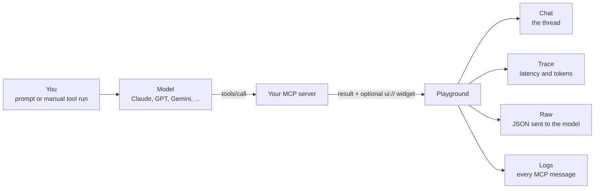

The Playground is the main workspace for developing against your MCP servers. It combines chat, manual tool invocation, widget rendering, traces, and a live JSON-RPC logger into a single IDE-style surface, so you can build, test, and debug an MCP server (or compare several side by side) without switching tabs.

<Frame>
  
</Frame>

<Note>
  The Playground replaces the standalone **Chat** and **App Builder** tabs.
  Everything those tabs did is here, plus multi-host compare and a dockable
  Sessions rail.
</Note>

## When to use the Playground

Reach for the Playground when you want to see how a real host would drive your MCP server: the model's tool calls, the raw JSON-RPC traffic, and any widget your tools return, all in one place.

It is the right surface for three jobs in particular:

- A first smoke test of a server you just connected.
- Iterating on a tool or a widget without prompting a model every time.
- Checking that the same tool call behaves the same way under ChatGPT, Claude, and Cursor.

## What you'll learn on this page

- How a Playground run actually works, end to end.
- How to complete your first run against a live server.
- How to read the Chat, Trace, Raw, and Logs views.
- Where to find the detailed guide for any Playground control.

Every advanced setting has its own guide. This page is the map, not the manual.

## How a Playground run works



Two things are worth noticing in that flow. First, the model is optional: you can run a tool directly from the **Tools** rail and skip it entirely. Second, one run produces four simultaneous views of itself, which is why debugging usually means switching views rather than re-running the prompt.

## Your first run

<Steps>
<Step title="Select or connect a server">
Add and connect an MCP server from the [Clients](/inspector/clients) tab, or click the **+** button in the chat input and use **+ Add server** without leaving the Playground.

On first launch, MCPJam already connects the Excalidraw sample server, so you can start here with no setup of your own.

<Check>
The server shows **Connected** in the **Clients** tab, and its tools appear in the Playground's left rail.
</Check>
</Step>

<Step title="Choose a model or host">
Open the model picker in the chat input and pick a model. Free frontier models (Claude, GPT, Gemini, DeepSeek, and more) need no API key.

The host picker at the top-left of the center header controls which host environment your widgets render under. New sessions start with **ChatGPT, Claude, and Cursor** pre-selected.

<Check>
The model name shows in the chat input, and the host picker shows at least one selected host.
</Check>
</Step>

<Step title="Send a simple prompt">
With the Excalidraw sample server connected, send:

```
Draw me an MCP architecture diagram
```

Press **Send**. Any prompt against your own server works the same way: ask for something one of its tools can do.

You don't have to go through a model. You can also pick a tool from the **Tools** rail on the left and execute it with your own input.
</Step>

<Step title="Review the response and tool call">
The model's tool call, its result, and any widget output appear inline in the chat thread. Every tool result has a row of debug icons in its header. Click one to open raw input and output, widget state, model context, or CSP activity for that call.

<Check>
You should see a tool call, its result, and, for a widget-returning tool, a rendered widget inline in the thread. If nothing happens, confirm the server is still **Connected** and that its tools are listed in the left rail.
</Check>
</Step>

<Step title="Continue to debugging or comparison">
Switch the segmented control at the top of the center pane to **Trace** to see what the turn cost, or open the **Logs** tab in the right rail to watch the protocol traffic. To check the same prompt across models or hosts, open the model or host picker and add a second one.

<Check>
Your run is complete. The conversation is already saved in the **Sessions** tab of the left rail, so you can come back to it.
</Check>
</Step>
</Steps>

## Chat, Trace, Raw, and Logs

One run, four views. Three of them sit behind the segmented control at the top of the center pane; Logs lives in the right rail.

| View | Where it is | What it answers |
|---|---|---|
| **Chat** | Center pane, segmented control | What did the model say, which tools did it call, and what did the widget look like? |
| **Trace** | Center pane, segmented control | Which step was slow, and how many tokens did each turn cost? |
| **Raw** | Center pane, segmented control | What exactly did the model receive: system prompt, tool definitions, history? |
| **Logs** | Right rail | What actually went over the wire between the inspector and my server? |

A useful habit: when a result looks wrong, start in **Chat**, confirm the arguments in the result's **Data** panel, and only drop to **Logs** when you suspect the request never reached your server the way you think it did.

All four views, plus the per-result debug panels behind them, are covered in [Debug & compare](/inspector/playground/debug-compare).

## What do you want to do next?

<CardGroup cols={2}>
  <Card title="Chat & tools" icon="message-circle" href="/inspector/playground/chat-tools">
    Layout and rails, the model picker and credits, the input bar, attachments, system prompt and temperature, tool approval, voice, context meter, skills, prompts, sessions, and manual tool invocation.
  </Card>
  <Card title="Debug & compare" icon="bug" href="/inspector/playground/debug-compare">
    Chat / Trace / Raw, tool-call data, widget state, model context, CSP and mounts, editing input and output, Logs and Shell, sign-in links, and multi-model and multi-host compare.
  </Card>
  <Card title="Test widgets" icon="app-window" href="/inspector/playground/test-widgets">
    Host context toolbar, host styles and capabilities, viewports, theme, locale, timezone, CSP mode, device capabilities, safe areas, display modes, and widget rendering rules.
  </Card>
  <Card title="Advanced" icon="wrench" href="/inspector/playground/advanced">
    Built-in workspace tools, their approval behavior, and form, URL, and URL-required elicitation.
  </Card>
</CardGroup>

## What the Playground can do

Every capability on this list is documented in full on one of the guides linked below.

- **Chat with frontier models**: talk to your server using Claude, GPT, Gemini, DeepSeek, and more at no cost, no API key required. Organizations can configure additional model providers in their organization settings.
- **Manual tool invocation**: run any tool from the Tools rail with your own inputs to iterate on a widget or response without prompting a model.
- **Widget emulator**: render widgets exposed via `openai/outputTemplate` (ChatGPT Apps) or `ui.resourceUri` (MCP Apps) the same way a real host would, with Inline, Picture-in-Picture, and Fullscreen display modes.
- **Chat / Trace / Raw views**: switch between the conversation, a timestamped timeline of every step (with per-step latency and tokens), and the exact JSON payload sent to the model.
- **Multi-model compare**: send a single prompt to up to 3 models at once and watch the responses side by side.
- **Multi-host compare**: render the same tool call under multiple host configurations (ChatGPT vs Claude, different device sizes, different capability sets) at the same time. New sessions start with ChatGPT, Claude, and Cursor pre-selected so the comparison is immediate.
- **Display context controls**: device viewport, light/dark theme, host style, locale, timezone, CSP mode, device capabilities, and safe area insets, all live in the toolbar.
- **Per-widget debugging**: inspect raw tool input/output, `widgetState`, model context, and CSP violations from icons above each widget.
- **JSON-RPC logger**: real-time, filterable feed of every message between the inspector and your servers.
- **Sessions rail**: resume, archive, and search past conversations from the left rail.
- **Skills and prompts**: type `/` to inject skills or MCP prompts directly into the chat.
- **Edit tool input/output live**: click **Edit** on any tool-result card to tweak the input or output JSON and watch the widget re-render instantly. **Run** re-executes the tool with your edited input.
- **Voice input**: click the mic button in the chat input to record your voice. The audio is transcribed and the text is inserted into the composer.

## Feature index

### By goal

| If you want to... | Go to |
|---|---|
| Chat with a server or change models | [Chat & tools](/inspector/playground/chat-tools) |
| Invoke a tool manually or save a request | [Chat & tools](/inspector/playground/chat-tools) |
| Inspect a tool call's data, state, or logs | [Debug & compare](/inspector/playground/debug-compare) |
| Compare model or host behavior | [Debug & compare](/inspector/playground/debug-compare) |
| Test viewports, themes, CSP, or display modes | [Test widgets](/inspector/playground/test-widgets) |
| Use workspace tools or elicitation | [Advanced](/inspector/playground/advanced) |

### By control

Every Playground control, and the page that documents it.

| Control or behavior | Documented in |
|---|---|
| Three-column layout, collapsible rails | [Chat & tools](/inspector/playground/chat-tools#layout) |
| Chat, Trace, and Raw views | [Debug & compare](/inspector/playground/debug-compare#chat-trace-and-raw-views) |
| Model picker, free models, your providers | [Chat & tools](/inspector/playground/chat-tools#model-picker) |
| Out-of-credits state, bring your own key | [Chat & tools](/inspector/playground/chat-tools#out-of-credits-state) |
| Server selection, add server, attach files | [Chat & tools](/inspector/playground/chat-tools#input-bar) |
| System prompt, temperature, tool approval | [Chat & tools](/inspector/playground/chat-tools#input-bar) |
| Voice input, context meter, token estimates | [Chat & tools](/inspector/playground/chat-tools#input-bar) |
| Skills and MCP prompts (the `/` picker) | [Chat & tools](/inspector/playground/chat-tools#skills) |
| Sessions rail: resume, rename, archive, search | [Chat & tools](/inspector/playground/chat-tools#sessions) |
| Tools rail, manual invocation, saved requests | [Chat & tools](/inspector/playground/chat-tools#tools-rail-manual-invocation) |
| Debug panels: Data, Widget State, Model Context | [Debug & compare](/inspector/playground/debug-compare#per-widget-debugging) |
| CSP violations, suggested fix, Mounts | [Debug & compare](/inspector/playground/debug-compare#csp) |
| Sign-in links from computer-backed tools | [Debug & compare](/inspector/playground/debug-compare#sign-in-links) |
| Edit tool input and output live, re-run, revert | [Debug & compare](/inspector/playground/debug-compare#edit-input--output) |
| JSON-RPC logger: search, filter, copy, download | [Debug & compare](/inspector/playground/debug-compare#logs-tab) |
| Shell tab and Project Computer terminal | [Debug & compare](/inspector/playground/debug-compare#shell-tab) |
| Multi-model compare (up to 3 models) | [Debug & compare](/inspector/playground/debug-compare#multi-model-compare) |
| Multi-host compare and the lead host | [Debug & compare](/inspector/playground/debug-compare#multi-host-compare) |
| Shared-session limits on compare features | [Debug & compare](/inspector/playground/debug-compare) |
| Device viewports, theme, safe area insets | [Test widgets](/inspector/playground/test-widgets#host-context-toolbar) |
| Host styles and host capability presets | [Test widgets](/inspector/playground/test-widgets#host-style) |
| Locale and timezone | [Test widgets](/inspector/playground/test-widgets#locale) |
| CSP mode, permissive and strict | [Test widgets](/inspector/playground/test-widgets#csp-mode) |
| Device capabilities: hover and touch | [Test widgets](/inspector/playground/test-widgets#device-capabilities) |
| Display modes: inline, PiP, fullscreen | [Test widgets](/inspector/playground/test-widgets#display-modes) |
| Widget rendering and capability gating | [Test widgets](/inspector/playground/test-widgets#widget-rendering) |
| Download confirmation dialog | [Test widgets](/inspector/playground/test-widgets#download-confirmation) |
| Workspace tools and which ones need approval | [Advanced](/inspector/playground/advanced#workspace-tools) |
| Form elicitation | [Advanced](/inspector/playground/advanced#form-elicitation) |
| URL elicitation and its safety warnings | [Advanced](/inspector/playground/advanced#url-elicitation) |
| URL-required notices (MCP error `-32042`) | [Advanced](/inspector/playground/advanced#url-required-notices) |

## Related pages

- [Clients](/inspector/clients): manage MCP server connections, transports, and OAuth.
- [Skills](/inspector/skills): configure skills that the Playground can use.
- [Projects](/inspector/projects): organize servers, sessions, and views into shared workspaces.
