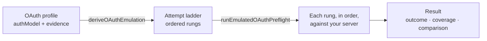

Client emulation reproduces how a specific MCP client authenticates — the order it tries mechanisms in, the registration strategy it prefers, the registration body it sends — and runs that sequence against your real server, without running the client itself. Use it to find out whether a given client would get a token from your server, and what your server did at each step if it would not.

Use `runEmulatedOAuthPreflight` to execute an emulated client's authentication ladder against a real MCP server, headlessly. The runner compiles an evidence-backed OAuth profile into ordered attempts, executes each one over the hardened OAuth networking path, and returns a structured result with three independent dimensions: `outcome`, `coverage`, and `comparison`.



<Note>
  `runEmulatedOAuthPreflight` is Node-only. The redirect-planning utilities
  (`planCompletionSafeRedirects`, `isInvalidRedirectUriRejection`) and their
  types are also exported from the browser-safe entry point.
</Note>

## Import

```typescript
import {
  runEmulatedOAuthPreflight,
  planCompletionSafeRedirects,
  isInvalidRedirectUriRejection,
} from "@mcpjam/sdk";
```

---

## Quick start

```typescript
import { deriveOAuthEmulation, runEmulatedOAuthPreflight } from "@mcpjam/sdk";

// 1. Compile a profile into machine knobs and an attempt ladder.
const emulation = deriveOAuthEmulation({
  profileVersion: 2,
  authModel: {
    status: "verified",
    value: ["oauth2-dcr"],
    source: "https://example.com/capture",
    capturedAt: "2026-01-01",
  },
});

// 2. Run the ladder headlessly against a real server.
const result = await runEmulatedOAuthPreflight({
  serverUrl: "https://your-server.com/mcp",
  emulation,
  callbackUrl: "http://127.0.0.1:41234/callback",
  completeAuthorization: async ({ authorizationUrl, callbackUrl }) => {
    // Drive consent headlessly (e.g. Playwright) and return the code.
    const code = await yourConsentDriver(authorizationUrl, callbackUrl);
    return { code };
  },
});

console.log(result.outcome);       // "completed"
console.log(result.credentials);   // { accessToken, clientId, ... }
console.log(result.sideEffects);   // { dcrRegistrations: 1, tokensIssued: 1 }
console.log(result.comparison);    // "not_compared" — always, until step 6
```

---

## Reading the result

Four things answer most questions about a run:

- **`outcome`** — the verdict for the whole ladder. `"completed"` means a real token *and* a valid authenticated JSON-RPC response; the other values are in [`EmulatedOAuthPreflightOutcome`](#emulatedoauthpreflightoutcome).
- **`attempts`** — one entry per rung, in ladder order, each with a `status` and a human-readable `detail`. This is where you see which mechanism the server accepted or rejected, and `httpHistory` carries the redacted trace for that rung.
- **`divergences`** — every declared difference between what the real client would send and what this run sent, compile-time and runtime.
- **`coverageSummary`** — `"complete"` only when every profile field is modeled. A `"partial"` run tested less than the real client's behavior.

`comparison` is always `"not_compared"`: a run never implies parity with a golden trace on its own. Check `sideEffects` to see what the run caused on the target — at most two DCR registrations per run.

---

## Attempt ladder

The `authModel` field of an OAuth profile compiles into an ordered attempt ladder. The runner executes each rung in sequence, with these fallback rules:

- **Consecutive `oauth2-*` entries collapse into one OAuth attempt** carrying their relative order as a registration preference. A client that lists `["oauth2-cimd", "oauth2-dcr"]` performs a single OAuth dance preferring CIMD, not two separate dances.
- **`api-key` and `none` stay in position** as direct MCP probes, so a "static bearer first, OAuth on 401" client reproduces that sequence exactly.
- A static credential falls through to OAuth **only on a 401**. Any other status stops the ladder.
- An OAuth attempt falls through to the next strategy **only while nothing has been committed on the wire** — once a registration request has been sent or authorization has begun, failure stops the ladder.

```typescript
// Profile: try static credential first, fall back to DCR on 401.
const emulation = deriveOAuthEmulation({
  profileVersion: 2,
  authModel: {
    status: "verified",
    value: ["api-key", "oauth2-dcr"],
    source: "...",
    capturedAt: "2026-01-01",
  },
});

// result.attempts will be:
// [{ kind: "api-key", status: "unauthorized" }, { kind: "oauth", status: "ok" }]
```

When `authModel` has no evidence, the runner uses MCPJam's own AUTO precedence: `preregistered` → `cimd` → `dcr`, filtered to what the negotiated protocol version supports.

---

## `runEmulatedOAuthPreflight`

### `EmulatedOAuthPreflightConfig`

| Property | Type | Required | Default | Description |
|----------|------|----------|---------|-------------|
| `serverUrl` | `string` | Yes | | MCP server URL. |
| `emulation` | `DerivedOAuthEmulation` | Yes | | Compiled profile from `deriveOAuthEmulation`. |
| `callbackUrl` | `string` | Yes | | MCPJam-controlled callback. Authorization and token legs always use it; registration replays the captured list with it appended. |
| `serverName` | `string` | No | `"Emulated OAuth Preflight"` | Display name used in log entries. |
| `clientIdMetadataUrl` | `string` | No | MCPJam default | CIMD metadata document URL for CIMD attempts. |
| `preregistered` | `{ clientId: string; clientSecret?: string }` | No | | Pre-registered credentials for `preregistered` strategy rungs. |
| `staticCredential` | `{ headerName: string; value: string }` | No | | Static credential for `api-key` rungs. Absent means the rung is skipped and declared — the runner never invents a credential. |
| `customHeaders` | `Record<string, string>` | No | | Extra HTTP headers on every request. |
| `customScopes` | `string` | No | | Space-separated scope string. |
| `timeoutMs` | `number` | No | `30000` | Total deadline for each outbound request. |
| `maxSteps` | `number` | No | `40` | Maximum state-machine steps per OAuth attempt. |
| `completeAuthorization` | `(input: { authorizationUrl: string; callbackUrl: string }) => Promise<{ code: string }>` | No | | Headless consent handler. Absent means the run stops at the redirect and reports `stopped_at_redirect`. |
| `requestExecutor` | `OAuthRequestExecutor` | No | Hardened default | Override the outbound executor (tests, alternate transports). The default uses DNS pinning, total-deadline timeouts, body caps, redirect caps, and cross-origin credential stripping. |
| `allowLoopbackMetadataFetch` | `boolean` | No | `false` | Allow fetching OAuth metadata from loopback addresses. |
| `resourceIndicatorEnforcement` | `"warn" \| "reject" \| "reject-rfc9728"` | No | `"warn"` | How to handle unexpected resource indicators. Defaults to `"warn"` so the run exposes server behavior rather than hiding it. |

### `EmulatedOAuthPreflightOutcome`

| Value | Meaning |
|-------|---------|
| `"completed"` | Real token obtained AND a valid authenticated JSON-RPC response received. |
| `"stopped_at_redirect"` | Ladder reached the human authorization leg; no `completeAuthorization` handler was supplied. |
| `"static_credential_ok"` | Server accepted the emulated client's static credential. |
| `"unauthenticated_ok"` | Server served an unauthenticated request (client models no auth). |
| `"blocked"` | The ladder ran out of usable mechanisms. |
| `"error"` | A transport or protocol error stopped the run. |

### `EmulatedOAuthPreflightResult`

| Property | Type | Description |
|----------|------|-------------|
| `serverUrl` | `string` | The server URL tested. |
| `protocolVersion` | `OAuthProtocolVersion` | Protocol version derived from the profile. |
| `outcome` | `EmulatedOAuthPreflightOutcome` | Overall run outcome. |
| `coverage` | `OAuthEmulationCoverage` | Per-field enforcement status, carried from the compiler. |
| `coverageSummary` | `"complete" \| "partial"` | `"complete"` only when every field is `"modeled"`. |
| `comparison` | `"not_compared"` | Always `"not_compared"` — golden-trace comparison is a later step. A run never implies parity on its own. |
| `attempts` | `EmulatedAuthAttemptResult[]` | Per-rung results, in ladder order. |
| `authorizationUrl` | `string` | Present when `outcome === "stopped_at_redirect"`. |
| `divergences` | `OAuthEmulationDivergence[]` | Compile-time divergences plus everything this run declared. |
| `sideEffects` | `{ dcrRegistrations: number; tokensIssued: number }` | What this run caused on the target. At most two DCR registrations per run. |
| `credentials` | `{ accessToken?, refreshToken?, clientId?, clientSecret? }` | Secrets returned once, kept out of every diagnostic surface. |
| `error` | `{ message: string }` | Present when `outcome === "error"`. |

### `EmulatedAuthAttemptResult`

| Property | Type | Description |
|----------|------|-------------|
| `kind` | `"oauth" \| "api-key" \| "none"` | Which rung this result is for. |
| `status` | `"ok" \| "unauthorized" \| "skipped" \| "redirected" \| "blocked" \| "error"` | Rung outcome. |
| `registrationStrategy` | `EmulatedRegistrationPreference` | Which registration strategy actually ran, for `oauth` attempts. |
| `plan` | `ResolvedAuthorizationPlan` | The resolved authorization plan, for `oauth` attempts. |
| `httpHistory` | `HttpHistoryEntry[]` | Redacted HTTP trace. Never carries tokens, codes, secrets, or PKCE values. |
| `detail` | `string` | Human-readable explanation of the outcome. |

---

## Completion-safe redirects

The runner must replay the real client's registration body while still finishing the dance with a real token. It resolves this with `planCompletionSafeRedirects`:

- The registration body carries the captured `redirect_uris` **in captured order, with MCPJam's callback appended**. The appended entry is a declared divergence.
- The authorization and token legs **always** use MCPJam's callback, so the code comes back and can be exchanged.
- If the server rejects the registration with a structured RFC 7591 `invalid_redirect_uri` (exactly HTTP 400 with `{ "error": "invalid_redirect_uri" }`), the runner re-registers with MCPJam's callback alone. That is the second and final registration a run will ever perform.

### `planCompletionSafeRedirects`

```typescript
import { planCompletionSafeRedirects } from "@mcpjam/sdk";

const plan = planCompletionSafeRedirects({
  capturedRedirectUris: ["cursor://anysphere.cursor-retrieval/callback"],
  callbackUrl: "http://127.0.0.1:41234/callback",
});

// plan.registrationRedirectUris:
//   ["cursor://anysphere.cursor-retrieval/callback", "http://127.0.0.1:41234/callback"]
// plan.authorizationRedirectUri:
//   "http://127.0.0.1:41234/callback"
// plan.divergences:
//   [{ kind: "redirect-uri-appended", ... }]
```

**Input:**

| Property | Type | Description |
|----------|------|-------------|
| `capturedRedirectUris` | `string[]` | Redirect URIs from the real client's registration, in captured order. |
| `callbackUrl` | `string` | MCPJam-controlled callback to append. |

**Output (`CompletionSafeRedirectPlan`):**

| Property | Type | Description |
|----------|------|-------------|
| `registrationRedirectUris` | `string[]` | `redirect_uris` for the registration body. |
| `authorizationRedirectUri` | `string` | Callback for the authorization and token legs. Always MCPJam's. |
| `divergences` | `OAuthEmulationDivergence[]` | Declared differences from the captured registration. |

### `isInvalidRedirectUriRejection`

Returns `true` only when a registration response is exactly HTTP 400 with `{ "error": "invalid_redirect_uri" }` in the body — the structured RFC 7591 error that authorizes a retry. Any other status or body shape returns `false`.

```typescript
import { isInvalidRedirectUriRejection } from "@mcpjam/sdk";

isInvalidRedirectUriRejection({ status: 400, body: { error: "invalid_redirect_uri" } }); // true
isInvalidRedirectUriRejection({ status: 400, body: { error: "invalid_client_metadata" } }); // false
isInvalidRedirectUriRejection({ status: 401, body: { error: "invalid_redirect_uri" } }); // false
```

---

## Diagnostics hygiene

Credentials are returned once, in `result.credentials`, and are kept out of every other surface:

- `result.attempts[*].httpHistory` is redacted — no tokens, codes, secrets, or PKCE values.
- A caller-supplied `staticCredential` is scrubbed by header name and value before the generic redactor runs, because no generic redactor can know an unconventional header name like `X-Acme-Tenant-Token`.
- `result.comparison` is always `"not_compared"` — a run never claims parity with a golden trace on its own.

---

## Related

- [OAuth Conformance SDK](/sdk/reference/oauth-conformance) — conformance testing with `OAuthConformanceTest`
- [CLI: OAuth Conformance](/cli/oauth-conformance) — CLI recipes and CI integration
